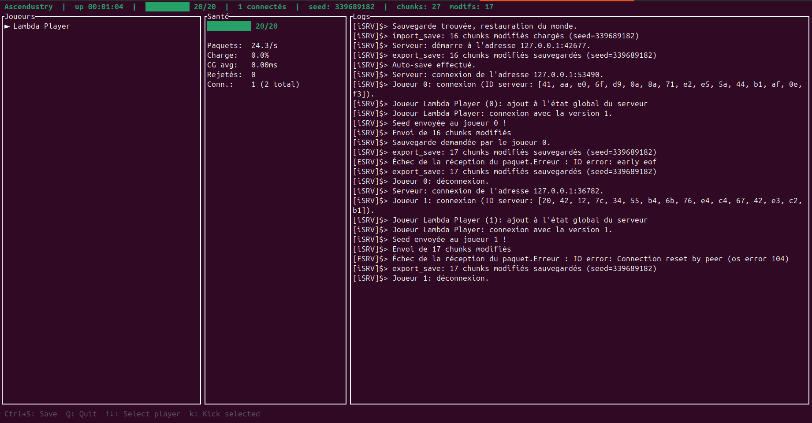

# Ascendustry — Les récentes avancées

> Posté le 20 juin 2026



Le précédent article sur le prédécesseur du projet datait du 6 mai et portait sur l'architecture réseau de *Ascendustry*. Depuis, le projet a changé de nom pour **Ascendustry**, et énormément de fonctionnalités ont été ajoutées — principalement côté serveur et gameplay. Voici un tour d'horizon de ce qui a été fait depuis.

---

## Identité joueur et persistance

Le serveur gère désormais une véritable identité pour chaque joueur, via un système de handshake au moment de la connexion. Cela permet de :

- Sauvegarder l'état de chaque joueur individuellement
- Restaurer la position du joueur à sa reconnexion, évitant de réapparaître au spawn à chaque fois
- Associer un inventaire personnel à chaque joueur


---

## Système d'inventaire complet

L'inventaire a été implémenté en quatre parties :

### Parties 1 & 2 — Structures et réseau

Les structures d'inventaire sont sérialisables via Serde et échangées entre le client et le serveur grâce à deux nouveaux paquets réseau :

```rust
pub struct InventoryUpdate {
    pub slot: u16,
    pub item: Option<ItemStack>,
}

pub struct InventorySet {
    pub slots: Vec<(u16, Option<ItemStack>)>,
}
```

L'inventaire est synchronisé en temps réel : casser un bloc envoie une `InventoryUpdate` au client, et le serveur peut envoyer un `InventorySet` complet pour initialiser l'état.

### Parties 3 & 4 — Finalisation et synchronisation

Les bugs de `add_item` ont été corrigés, la gestion des stacks est fonctionnelle, et l'inventaire est correctement mis à jour lors du cassage d'un bloc.

### Tests

Un fichier de tests unitaires couvre les cas limites de l'inventaire.

---

## Protection anti-DDoS

Un système de **rate limiting** a été implémenté pour protéger le serveur contre les connexions abusives :

```rust
pub struct RateLimiter {
    max_connections_per_ip: u32,
    max_packets_per_second: u32,
    connections: HashMap<IpAddr, ConnectionMetrics>,
}
```

La configuration est définie dans le fichier de config du serveur.

---

## Dashboard TUI

Le serveur embarque désormais un dashboard en temps réel directement dans le terminal, construit avec [Ratatui](https://github.com/ratatui-org/ratatui) :

- **Compteur de joueurs connectés**, avec tendance sur la session
- **Métriques réseau** (paquets envoyés/reçus)
- **Temps de tick** moyen du serveur
- **Taux de guard cycle** réglé à 20 Hz pour économiser les ressources

Le composant utilise une architecture à deux threads : le serveur pousse les métriques via un canal, et le TUI les affiche de manière asynchrone et complètement détachée des autres threads.

```rust
pub struct ServerMetrics {
    pub connected_players: u32,
    pub peak_players: u32,
    pub packets_sent: AtomicU64,
    pub packets_received: AtomicU64,
    pub tick_times: Vec<f32>,
}
```

---

## Propreté et optimisations serveur

Plusieurs correctifs et optimisations ont été apportés :

- **Déconnexion propre** des joueurs — le state est correctement nettoyé
- **Kick joueur** — commande serveur pour expulser un joueur
- **Guard cycle à 20 Hz** au lieu de tourner en boucle serrée
- **Sauvegarde avant arrêt** — le monde est sauvegardé automatiquement quand le serveur s'arrête
- **Correction de scope lock** — un bug qui pouvait causer des deadlocks a été résolu
