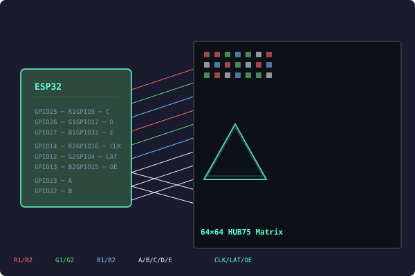

# Driver HUB75 pour matrice 64×64 — Bit-bang sur ESP32

> Posté le 15 juin 2026



J'ai écrit un driver en Rust pour piloter une matrice de LEDs **HUB75 64×64** avec un **ESP32**. Pas de module spécial, pas de librairie externe — juste des broches GPIO qu'on contrôle directement.

Le code est ici : [github.com/Theora59-dev/driver-hub75-64x64-pixel-matrix](https://github.com/Theora59-dev/driver-hub75-64x64-pixel-matrix)

---

## Comment ça fonctionne

Le driver a trois parties :

### 1. Les signaux bas niveau

14 broches GPIO sont utilisées :

- **6 pour les données** : R1, G1, B1 (moitié haute) + R2, G2, B2 (moitié basse)
- **5 pour l'adresse** : A, B, C, D, E (choisir la rangée)
- **3 pour le contrôle** : CLK (horloge), LAT (verrouillage), OE (allumer/éteindre)

Le timing se fait avec des petites boucles d'attente. L'ESP32 tourne à 240 MHz, ça suffit :

```rust
fn pulse_clk(&mut self) {
    self.clk.set_high();
    self.delay_spin(30);
    self.clk.set_low();
    self.delay_spin(30);
}
```

### 2. Le framebuffer

Les pixels sont stockés dans un tableau 2D. La taille de la matrice est définie à la compilation, pas de mémoire allouée dynamiquement :

```rust
pub struct PixelMap<const W: usize, const H: usize> {
    pixels: [[Rgb565; W]; H],
}
```

Chaque pixel est codé sur 16 bits (rouge/vert/bleu), mais la matrice ne sait afficher que allumé ou éteint par couleur. Du coup on convertit : chaque composante devient soit 0 soit 1. Ça donne 8 couleurs possibles.

### 3. L'affichage

L'écran est balayé ligne par ligne très rapidement (persistance de vision). Pour chaque paire de rangées :

1. On éteint les LEDs
2. On choisit la rangée
3. On envoie les pixels colonne par colonne
4. On verrouille les données
5. On rallume les LEDs un petit moment

Les 64 rangées défilent assez vite pour qu'on voie l'image complète.

---

## Exemple du Moteur 3D

L'exemple le plus cool fait tourner un triangle en 3D directement sur l'ESP32. Le code fait les calculs de rotation, de projection, et dessine le triangle pixel par pixel :

```rust
fn project(v: &Vec3) -> (usize, usize) {
    let factor = 64.0 / (v.z + 4.0);
    let x = (v.x * factor + 64.0 / 2.0) as usize;
    let y = (v.y * factor + 64.0 / 2.0) as usize;
    (x, y)
}
```

Les FPS s'affichent sur le port série.

---

## Infos Supplémentaires

- **Pas de matériel spécial** — ça marche avec n'importe quelles broches GPIO. Parfait pour le prototypage.
- **Taille configurable** — on change la résolution dans le code, le compilateur vérifie tout tout seul.
- **Mémoire minimum** — pas de heap, pas d'allocations. Le framebuffer 64×64 prend 8 Ko **sur la stack**.
- **Format standard** — les pixels sont en RGB565 (courant), mais la matrice affiche en 8 couleurs. La conversion se fait à la volée.
