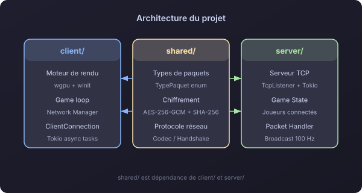
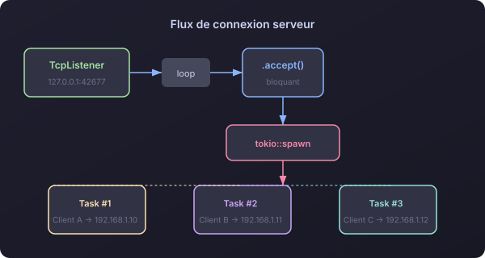
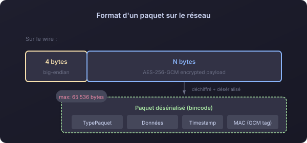
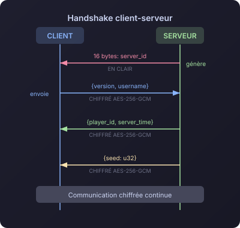
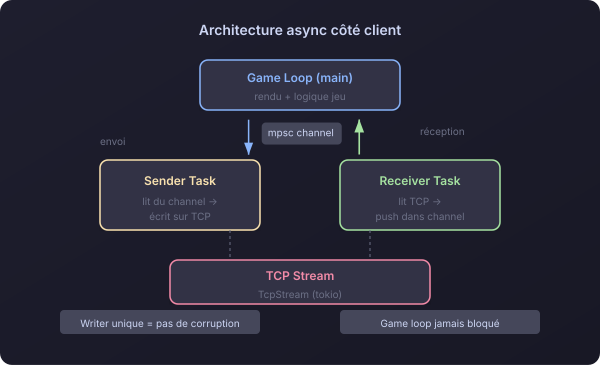
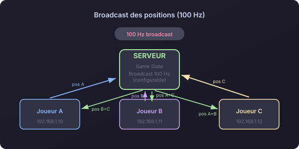
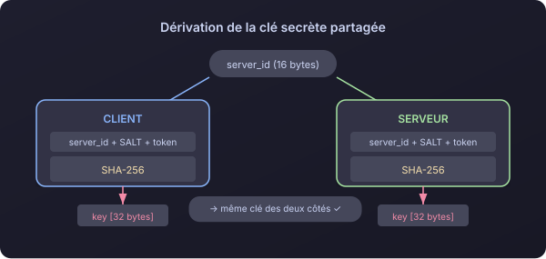
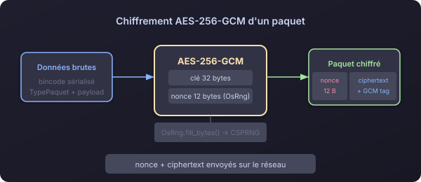
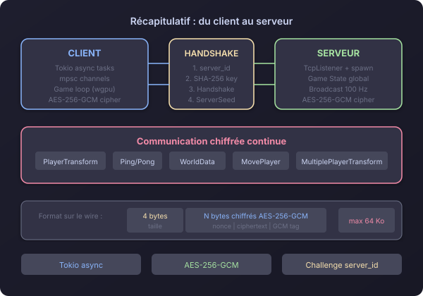

# Satisfactorio - Comment le réseau fonctionne en interne

> Posté le 6 mai 2026

J'ai récemment travaillé sur **Satisfactorio**, une ébauche de jeu voxel multijoueur en Rust développé from scratch avec [@StrachyDev](https://github.com/strachydev). Le projet ayant atteint un stade très correct de maturité, j'ai souhaité vous faire part de l'architecture et du système réseau que j'ai implémenté pour relier le client et le serveur. (Ça me permettra aussi d'avoir une trace du système et son évolution pour la suite du projet)



---

## Les bases

Le jeu tourne en TCP avec Tokio pour l'asynchrone et `bincode` pour la sérialisation. Le serveur écoute par défaut sur `127.0.0.1:42677`, et chaque connexion entrante se voit attribuer sa propre tâche tokio.



---

## Format d'un paquet sur le réseau



Taille max : **64 Ko**. Les types de paquets couvrent les besoins classiques d'un jeu :

```rust
pub enum TypePaquet {
    Handshake, HandshakeAck,
    PlayerTransformation, MultiplePlayerTransformation,
    ServerSeed, WorldData,
    MovePlayer, Ping, Pong,
}
```

---

## Le handshake

C'est la partie la plus intéressante. Voici comment client et serveur établissent la connexion :



1. Le serveur génère un `server_id` de 16 bytes via `getrandom` (CSPRNG) et l'envoie au client
2. Le client dérive une clé de 32 bytes avec SHA-256 : `hash(server_id + SALT + token)`
3. Le serveur fait le même calcul de son côté → les deux ont la même clé
4. Le client envoie le Handshake chiffré, le serveur répond avec le `player_id` et la `ServerSeed`
5. Toute la communication suivante est chiffrée

---

## L'architecture async côté client

Après le handshake, deux tâches tournent en background :



- **Sender Task** — Lit depuis un canal `mpsc` et écrit sur le TCP stream. Un seul writer évite la corruption des données par écritures concurrentes.
- **Receiver Task** — Lit en continu depuis le stream et pousse les paquets dans un canal. Le game loop principal n'est jamais bloqué.

Côté serveur, chaque client a sa task dédiée et les positions sont broadcastées à **100 Hz**.



---

## Le chiffrement AES-256-GCM

### Dérivation de la clé



```rust
pub fn compute_shared_secret(server_id: &[u8], token: &[u8]) -> [u8; 32] {
    let mut hasher = Sha256::new();
    hasher.update(server_id);
    hasher.update(SALT);
    hasher.update(token);
    hasher.finalize().into()
}
```

Client et serveur dérivent la même clé indépendamment grâce au `server_id`. C'est un schéma de type **pre-shared key** basé sur un challenge.

### Chiffrement



```rust
pub fn aes_encrypt(data: &[u8], cipher: &Aes256Gcm) -> Result<Vec<u8>, _> {
    let mut nonce_bytes = [0u8; 12];
    OsRng.fill_bytes(&mut nonce_bytes);
    let nonce = Nonce::from_slice(&nonce_bytes);
    let mut payload = cipher.encrypt(nonce, data)?;
    let mut output = nonce_bytes.to_vec();
    output.append(&mut payload);  // nonce + ciphertext
    Ok(output)
}
```

Chaque paquet est chiffré avec un **nonce aléatoire de 12 bytes** généré par `OsRng`. Le nonce est préfixé au ciphertext pour que le récepteur puisse déchiffrer. AES-256-GCM fournit chiffrement **et** authentification (MAC intégré).

---

## En résumé



Satisfactorio a une base réseau propre : Tokio pour l'async, des channels mpsc pour séparer reading/writing, et AES-256-GCM pour chiffrer les échanges.
