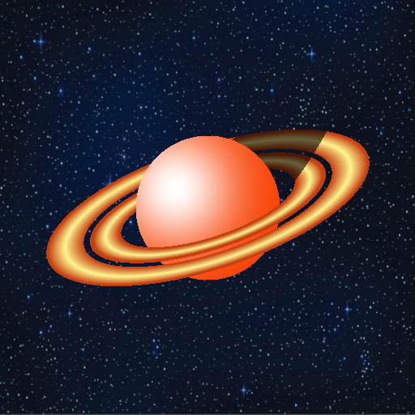
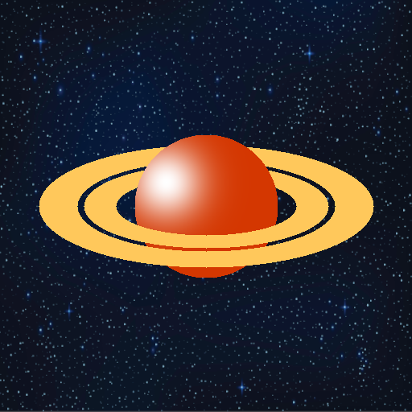

# Génération d'image BMP simple

# Une Planète avec des anneaux faite en C/C++ :

Dans le cadre de la L1 Informatique, l'occasion s'est présentée de programmer graphiquement une planète à l'aide d'une [librairie](https://github.com/Theora59-dev/bmp-image-manager) écrit en Rust. Le projet noté est donc de réaliser une planète (Saturne) ainsi que ses anneaux, en simulant un jeu d'ombre assez primitif, mais toutefois intéréssant.



Vous pouvez trouver le code complet *[ici](https://github.com/Theora59-dev/2025-tp-systemes-logiques)*

## Étapes de création

Pour la programmation, j'ai choisis de me baser sur une logique de fonctions booléennes, ce que m'a rendu le travail plus simple pour la suite du projet. 
Il est donc fréquent, dans le main.cpp de trouver des structure comme celle dessous qui se répètes:

```Algorithmie
Si est_dans_une_zone(x, y, autres paramètres...) {
    placer_pixel(x, y)
```

J'en profite aussi pour préciser que le toutes les instructions pour modifier l'images sont éxecutées pour tout pixel dans le plan 2D

1. Tout d'abord, il a fallu dessiner la planète, à savoir un disque remplit - qui, sans aucun doute, étais la partie la plus simple.

```cpp
bool is_on_planet = is_in_circle(planet_radius, (int)center_x, (int)center_y, x, y);
    if (is_on_planet) {
        current_pixel_color = color_planet;
}
```
  - Avec la fonction suivante:

```cpp
bool is_in_circle(int rayon, int centre_x, int centre_y, int x, int y){
    return (distance(centre_x, centre_y, x, y) <= rayon);
}
```
  
2. Il m'a fallu alors étendre la fonction afin de pouvoir dessiner des ellipses.
```cpp
bool is_in_elliptic_with_angle(double center_x, double center_y, double x, double y, double a, double b, double p, double q) {
    double dx = x - center_x;
    double dy = y - center_y;

    double u = p * dx + q * dy;
    double v = -q * dx + p * dy;

    return (u * u) / (a * a) + (v * v) / (b * b) - 1.0 <= 0.0;
}
```

3. Il suffit de faire de simple opération booléenne afin de pouvoir afficher de simples anneaux.
4. Pour les interpolation de couleur, j'ai choisi d'utiliser une méthode linéaire, de façon à pouvoir facilement l'utiliser si besoin dans la suite du projet

```cpp
Color interpolate_color(Color color1, Color color2, float t) {
    if (t < 0.0f) t = 0.0f;
    if (t > 1.0f) t = 1.0f;

    Color result_color;

    result_color.r = (int)(color1.r * (1 - t) + color2.r * t);
    result_color.g = (int)(color1.g * (1 - t) + color2.g * t);
    result_color.b = (int)(color1.b * (1 - t) + color2.b * t);
    result_color.a = (int)(color1.a * (1 - t) + color2.a * t);

    return result_color;
}
```
 
  
5. Enfin, il suffit de tout afficher dans le bon ordre de façon à mettre d'abord l'arrière (la partie supérieur) des anneaux, puis la planète et enfin l'avant des anneaux afin d'avoir une image intermédiaire.



6. Par la suite, il suffit d'orienter les anneaux, d'ajouter l'ombre de la planète sur les anneaux à l'aide d'une autre ellipse, d'ajouter la tâche, ainsi que les dégradés en fonctions de la position des pixels et le tour est joué !

```cpp
if (is_in_up_elliptic_ring_with_angle(center_x, center_y, x, y, a2_inner, b2_inner, a2_outer, b2_outer, ring_angle)) {
    double t = absolute_f_ellipse_with_angle(center_x, center_y, x, y, (a2_inner + a2_outer)/2, (b2_inner + b2_outer) / 2, ring_angle);
    current_pixel_color = interpolate_color(color_ring, color_ring_outer, t * color_coeff);
}
```
  *Code nécessaire pour afficher l'arrière d'un anneau.*
  
```cpp
if (is_on_planet && !is_in_bottom_rings) {
    afficher_tache(&main_matrix, x, y, center_x-50 * size_coef, center_y - 30 * size_coef, tache_coeff, color_plantet_glow);
}
```
  *Code nécessaire pour afficher la tâche sur la planète.*
  
```cpp
void afficher_tache(Matrice2D *matrice, int x, int y, int center_x, int center_y, double coeff, Color tache_color) {
    int dx = x - center_x;
    int dy = y - center_y;

    double d2 = dx * dx + dy * dy;

    double alpha = 255.0 * exp(-coeff * d2);

    if (alpha < 0.0) alpha = 0.0;
    if (alpha > 255.0) alpha = 255.0;

    double t = alpha / 255.0;

    int idx = calcul_idx(x, y);
    Color base = get_color_from_matrix(idx, matrice);

    Color final = interpolate_color(base, tache_color, t);
    set_color_pixel(final, idx, matrice);
}
```
  *Code de la fonction* ***afficher_tache()**.*
  
## Image finale


---
Nous obtenons alors l'image ci-dessus, qui m'a permis d'avoir un modeste 20/20 à l'UE (matière) Systèmes Logique et Numériques !

**Merci d'être arrivé jusqu'ici !**
